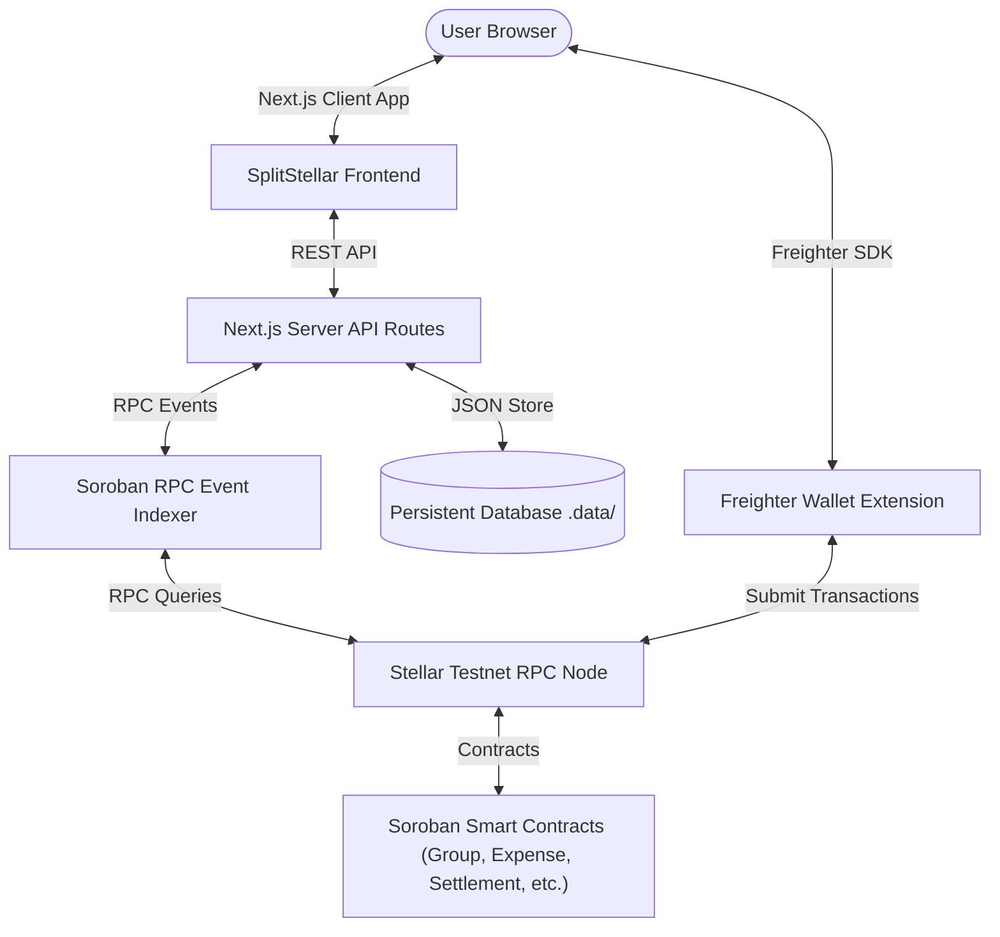
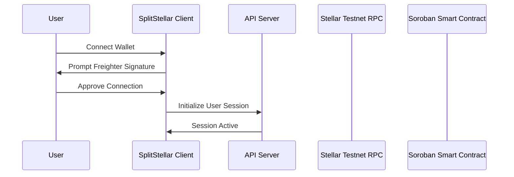
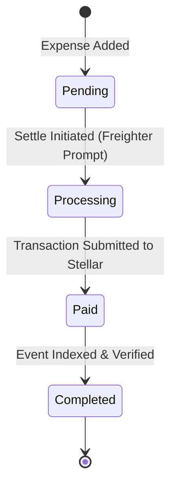
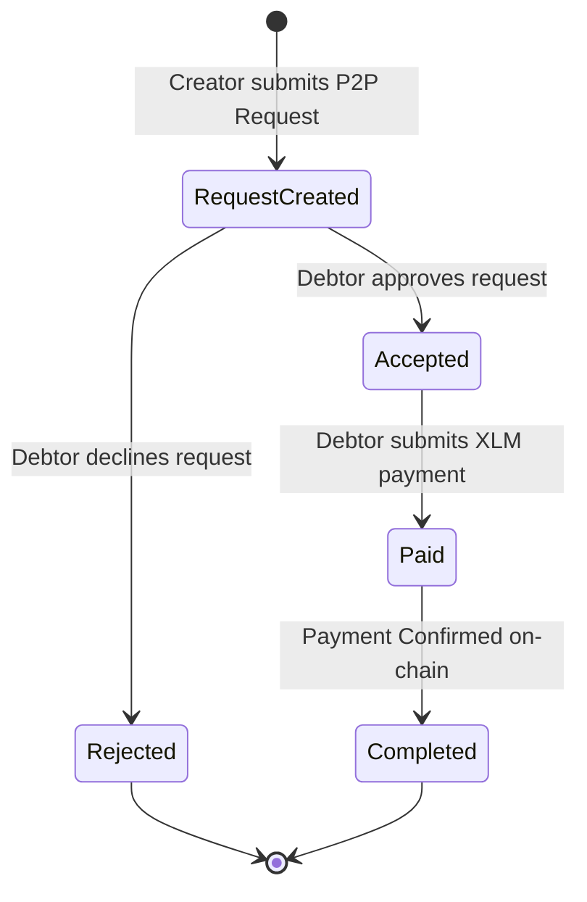
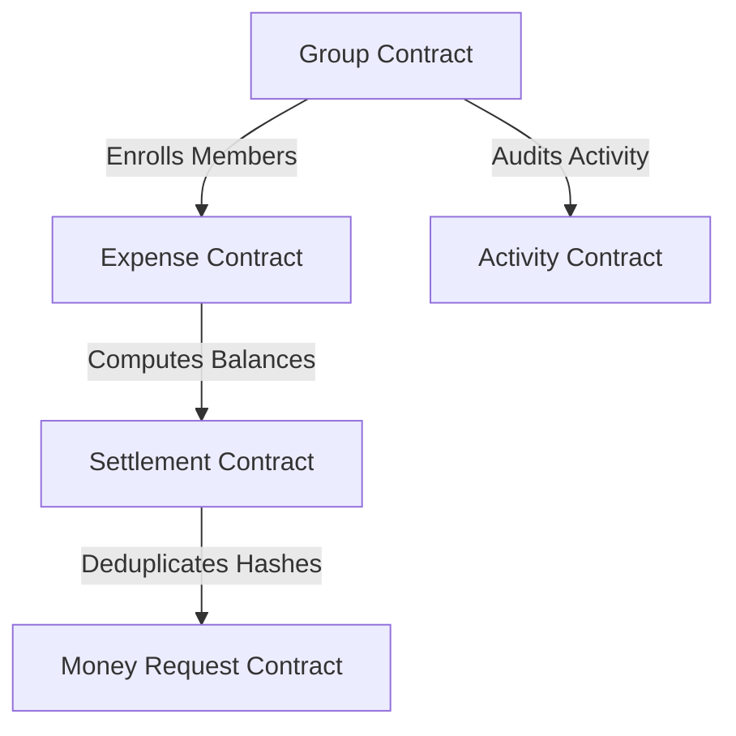
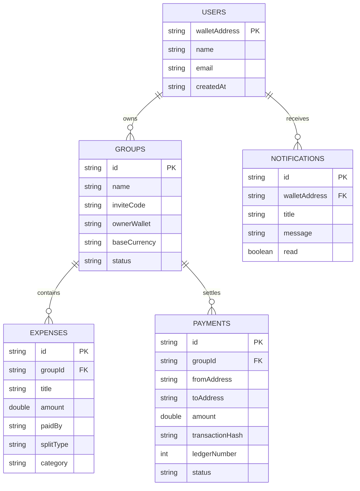

# SplitStellar 

<div align="center">
  
  <h3>Decentralized Cross-Border Expense Sharing & Debt Simplification on Stellar</h3>
  <p><strong>Built for the Stellar & Soroban Smart Contract Ecosystem</strong></p>
</div>

---

[](LICENSE)
[](https://www.typescriptlang.org/)
[](https://nextjs.org/)
[](https://react.dev/)
[](https://stellar.org/)
[](https://soroban.stellar.org/)
[](https://www.freighter.app/)
[](https://www.docker.com/)
[]()
[]()
[]()
[]()

SplitStellar is a decentralized expense sharing and peer-to-peer debt simplification platform built on the Stellar blockchain. By leveraging Soroban smart contracts, Freighter Wallet, and a graph-based debt simplification engine, SplitStellar eliminates centralized fee collection and offers instant, transparent, and secure group settlements.

---

## 📖 Table of Contents
1. [About the Project](#-about-the-project)
2. [Features](#-features)
3. [Technology Stack](#-technology-stack)
4. [System Architecture](#-system-architecture)
5. [Application Workflows](#-application-workflows)
6. [Smart Contract Architecture](#-smart-contract-architecture)
7. [Database Schema](#-database-schema)
8. [Folder Structure](#-folder-structure)
9. [Installation & Setup](#-installation--setup)
10. [Environment Variables](#-environment-variables)
11. [Soroban Contract Deployments](#-soroban-contract-deployments)
12. [API Reference](#-api-reference)
13. [Application Screenshots](#-application-screenshots)
14. [Security & Performance](#-security--performance)
15. [Testing & Quality Assurance](#-testing--quality-assurance)
16. [Roadmap & Contributions](#-roadmap--contributions)
17. [Hackathon Submission Materials](#-hackathon-submission-materials)
18. [License & Acknowledgements](#-license--acknowledgements)

---

## 🌟 About the Project

### Problem Statement
Traditional expense-sharing services rely on centralized database records, lack auditable guarantees, charge high fees for cross-border money transfers, and expose user transaction histories to data monetization.

### Why SplitStellar Exists
SplitStellar provides a decentralized, transparent alternative. It handles multi-currency transactions, simplifies peer-to-peer debts via a minimum cash flow graph algorithm, and allows users to settle balances directly from their own wallets using Freighter without intermediary fees.

### Blockchain Advantages
- **Auditability**: All groups, expenses, and settlements are permanently logged on-chain.
- **Near-Zero Fees**: Stellar Testnet transactions settle in seconds with virtually zero cost.
- **Non-Custodial**: SplitStellar never holds user funds; payments move wallet-to-wallet.

---

## ⚡ Features

| Feature | Description | Deployed Module |
|---|---|---|
| **Freighter Wallet Integration** | Secure wallet authentication, balance checks, and signature prompts. | `WalletContext.tsx` |
| **Group Management** | Create, edit, and archive shared expense groups with custom base currencies. | `group_contract` |
| **Base32 Invite Codes** | Invite members securely using short, clean invite codes (e.g. `SPLIT-X7K9P2`). | `group_contract` |
| **Expense Splitting** | Track group costs with Equal and Unequal split distributions. | `expense_contract` |
| **Net Debt Graph** | Consolidates complex group transactions into minimum payment flows. | `GraphView.tsx` |
| **Direct P2P Settlements** | Trigger Freighter wallet transactions to pay debtors directly on-chain. | `settlement_contract` |
| **Money Requests** | Create, accept, reject, and fulfill payment requests with full tx tracking. | `money_request_contract` |
| **Ledger Analytics** | Detailed charts showing spend volume, categories, and settlement ratios. | `AnalyticsView.tsx` |
| **Global Search** | Query database records (`Cmd+K`) by Group name, Member address, or Tx hash. | `SearchModal.tsx` |
| **Structured Logging** | Multi-level formatted logs (`INFO`, `WARN`, `ERROR`, `DEBUG`). | `lib/logger.ts` |
| **Offline Support** | Queue transactions locally when offline and auto-sync when back online. | `lib/offlineQueue.ts` |
| **Admin Dashboard** | Real-time RPC node status, indexer health, and database metrics. | `AdminDashboardView.tsx` |

---

## 🛠️ Technology Stack

- **Frontend**: Next.js 16 (React 19, TypeScript, Tailwind CSS, Lucide icons).
- **State Management**: Zustand & React Query.
- **Blockchain Interface**: `@stellar/stellar-sdk` & `@stellar/freighter-api`.
- **Backend API Layer**: Next.js Server API Routes.
- **Database Engine**: Persistent JSON File DB (`.data/splitstellar-db.json`) via `lib/db.ts`.
- **Smart Contracts**: Rust compiled to WASM targets on Soroban.
- **DevOps**: Docker, Docker Compose, GitHub Actions.

---

## 📐 System Architecture



---

## 🔄 Application Workflows

### Overall Architecture Flow


### Expense Settlement Lifecycle


### Money Request Lifecycle


---

## 📜 Smart Contract Architecture

SplitStellar's on-chain core is built from 5 distinct Soroban smart contracts written in Rust:



### 1. Group Contract (`group_contract`)
- Handles creation, updates, and archival of expense groups.
- Generates 6-character Base32 invite codes.
- Functions: `create_group`, `join_group_by_code`, `remove_member`, `archive_group`.

### 2. Expense Contract (`expense_contract`)
- Stores expense items, split structures, and payer data.
- Functions: `add_expense`, `edit_expense`, `delete_expense`.

### 3. Settlement Contract (`settlement_contract`)
- Records payment hashes and ledger positions for audits.
- Implements replay attack protection via transaction hash mapping.
- Functions: `record_payment`, `get_settlement`.

### 4. Money Request Contract (`money_request_contract`)
- Coordinates peer-to-peer payment requests and direct loans.
- Functions: `create_request`, `accept_request`, `reject_request`, `mark_request_paid`.

### 5. Activity Contract (`activity_contract`)
- Logs audit trails for all critical group updates.
- Functions: `log_activity`, `get_group_activities`.

---

## 🗄️ Database Schema

SplitStellar features a persistent database store indexer schema mapping on-chain records:



---

## 📂 Folder Structure

```
splitstellar/
├── .github/workflows/          # GitHub Actions CI/CD workflows
├── __tests__/                  # Unit and integration test suites
├── app/                        # Next.js App Router (pages and API routes)
│   ├── api/                    # REST API routes (health, status, search, etc.)
│   ├── layout.tsx              # Root HTML layout & Context wrapper
│   └── page.tsx                # Main view dashboard portal
├── components/                 # React UI Components
│   ├── admin/                  # Admin Dashboard health monitor
│   ├── collaboration/          # Presence bar & offline queue banner
│   ├── dashboard/              # Welcome banner, analytics chart
│   ├── graph/                  # Net Debt Graph ReactFlow canvas
│   └── layout/                 # Shared layouts (Navbar, Sidebar, Footer)
├── contracts/                  # Rust Soroban smart contract source
├── docs/                       # Architecture, API, and setup documentation
├── hooks/                      # Custom React hooks (Wallet, events, sync)
├── lib/                        # Common libraries (database engine, logger, Sentry)
├── public/                     # Static assets (logo.png, back.png)
├── services/                   # Business adapters (IndexerService)
├── stores/                     # Zustand state management stores
└── package.json                # Project configuration & npm scripts
```

---

## 🚀 Installation & Setup

### Prerequisites
- **Node.js**: v20+ installed.
- **Rust**: `rustc 1.93.0` & `cargo 1.93.0` with `wasm32-unknown-unknown` target.
- **Stellar CLI**: Installed (`stellar 25.2.0`).
- **Freighter Wallet**: Extension installed in your browser.

### Clone & Install
```bash
git clone https://github.com/your-username/splitstellar.git
cd splitstellar
npm install
```

### Run Locally
```bash
npm run dev
```
Open [http://localhost:3000](http://localhost:3000) in your browser.

---

## 🔑 Environment Variables

Create a `.env.local` file in the root directory:

| Environment Variable | Description | Example Value |
|---|---|---|
| `NEXT_PUBLIC_STELLAR_NETWORK` | Stellar passphrase network | `testnet` |
| `NEXT_PUBLIC_SOROBAN_RPC_URL` | Soroban RPC node URL | `https://soroban-testnet.stellar.org` |
| `NEXT_PUBLIC_GROUP_CONTRACT_ID` | Deployed group contract ID | `CDCTCARPCGDJURGQGXAS3MWQMEOYDSW2NFACWXPB2RQA6473NO6MXYPD` |
| `NEXT_PUBLIC_EXPENSE_CONTRACT_ID` | Deployed expense contract ID | `CCFKZY7P5Q6SQ453WFVNDR5IPWYTYVQIPYW64XMVQ6FLILLNWAHYAGIR` |
| `NEXT_PUBLIC_SETTLEMENT_CONTRACT_ID` | Deployed settlement contract ID | `CC75FXYJOTQXXOZ6Z647ARSO2AJZZULHWFJX7VB2BEFF4GRHUIHISMEJ` |
| `NEXT_PUBLIC_MONEY_REQUEST_CONTRACT_ID` | Deployed money request contract ID | `CDQZVM7QMWCCS6AAXPT5PIWQB7BM73LCEGLK6SP377ZSMCQNAQFETX7C` |
| `NEXT_PUBLIC_ACTIVITY_CONTRACT_ID` | Deployed activity contract ID | `CDOPXKRGOP2WN4M7BD7YDSM2K2YZ4ZDNP7L6PIALFEAMJOOE3KYXE6VS` |

---

## 📦 Soroban Contract Deployments

All 5 contracts are compiled and deployed to **Stellar Testnet** using `stellar-cli`:

| Smart Contract | Stellar Testnet Contract ID | Verification Link |
|---|---|---|
| **Group Contract** | `CDCTCARPCGDJURGQGXAS3MWQMEOYDSW2NFACWXPB2RQA6473NO6MXYPD` | [Stellar Lab Link](https://lab.stellar.org/r/testnet/contract/CDCTCARPCGDJURGQGXAS3MWQMEOYDSW2NFACWXPB2RQA6473NO6MXYPD) |
| **Expense Contract** | `CCFKZY7P5Q6SQ453WFVNDR5IPWYTYVQIPYW64XMVQ6FLILLNWAHYAGIR` | [Stellar Lab Link](https://lab.stellar.org/r/testnet/contract/CCFKZY7P5Q6SQ453WFVNDR5IPWYTYVQIPYW64XMVQ6FLILLNWAHYAGIR) |
| **Settlement Contract** | `CC75FXYJOTQXXOZ6Z647ARSO2AJZZULHWFJX7VB2BEFF4GRHUIHISMEJ` | [Stellar Lab Link](https://lab.stellar.org/r/testnet/contract/CC75FXYJOTQXXOZ6Z647ARSO2AJZZULHWFJX7VB2BEFF4GRHUIHISMEJ) |
| **Money Request Contract** | `CDQZVM7QMWCCS6AAXPT5PIWQB7BM73LCEGLK6SP377ZSMCQNAQFETX7C` | [Stellar Lab Link](https://lab.stellar.org/r/testnet/contract/CDQZVM7QMWCCS6AAXPT5PIWQB7BM73LCEGLK6SP377ZSMCQNAQFETX7C) |
| **Activity Contract** | `CDOPXKRGOP2WN4M7BD7YDSM2K2YZ4ZDNP7L6PIALFEAMJOOE3KYXE6VS` | [Stellar Lab Link](https://lab.stellar.org/r/testnet/contract/CDOPXKRGOP2WN4M7BD7YDSM2K2YZ4ZDNP7L6PIALFEAMJOOE3KYXE6VS) |

### Deployment Commands
```bash
# 1. Compile WASM Targets
stellar contract build

# 2. Deploy WASM Binary (Example Group Contract)
stellar contract deploy --wasm target/wasm32v1-none/release/group_contract.wasm --source alice --network testnet
```

---

## 🌐 API Reference

### Health check `/api/health`
- **Method**: `GET`
- **Description**: Returns basic API server check.
- **Response**:
  ```json
  {
    "status": "ok",
    "service": "SplitStellar API Server",
    "timestamp": "2026-07-21T23:55:00Z"
  }
  ```

### Subsystem Health `/api/status`
- **Method**: `GET`
- **Description**: Returns operational details of database records, indexers, and RPC connection state.

### Contract Addresses `/api/contracts/status`
- **Method**: `GET`
- **Description**: Returns deployed Soroban contract address mapping.

### Global Search `/api/search`
- **Method**: `GET`
- **Query Params**: `q` (search term).
- **Description**: Returns matching groups, expenses, payments, money requests, and member addresses.

---

## 🖼️ Application Screenshots

### 1. Welcome Dashboard Portal
*Place for: dashboard.png*
Displays total balance summaries, pending payments list, and recent activity log feed.

### 2. Live Debt Graph
*Place for: debt-graph.png*
Interactive ReactFlow canvas showing member balance nodes and simplified owing edge transfers.

### 3. Analytics Charts
*Place for: analytics.png*
Visual breakdown of categories, settlement ratios, and group spent volume comparisons.

---

## 🔒 Security & Performance

### Security Hardening
- **HTTP Security Headers**: Enforced in `next.config.ts` (`X-Frame-Options: DENY`, `X-Content-Type-Options: nosniff`).
- **Replay Protection**: Settlement contract verifies all transaction hashes and rejects duplicate replays.
- **Input Guard**: All contract parameters validate constraints (`amount > 0`) to prevent division-by-zero or zero payments.

### Performance Optimizations
- **Zustand Cache Store**: In-memory state query caching minimizing RPC network trips.
- **Offline Queue**: Detects network dropouts and queues posts for automatic sync upon reconnect.

---

## 🧪 Testing & Quality Assurance

### Automated Testing Suite
- **API Unit Testing**: Built via Vitest configuration in [`vitest.config.ts`](file:///d:/splitstellar/vitest.config.ts). Run checks with:
  ```bash
  npm test
  ```
- **TypeScript Strict Check**:
  ```bash
  npx tsc --noEmit
  ```

### Soroban Rust Tests
- Run smart contract tests:
  ```bash
  cd contracts
  cargo test
  ```

---

## 🗺️ Roadmap & Contributions

### Project Status: v1.0.0 Release
- Deployed 5 Soroban smart contracts on Stellar Testnet.
- Integrated Freighter wallet signing.
- Configured dynamic debt graph and analytics.
- Setup CI/CD, structured logger, Sentry monitors, and health endpoints.

### Future Enhancements
- Support for Stellar stablecoins (USDC / EURC).
- Multi-currency currency conversion adapters.

---

## 🏆 Hackathon Submission Materials

### Project Description
SplitStellar is a non-custodial group expense sharing platform leveraging Soroban Smart Contracts and Freighter Wallet to automate peer-to-peer settlements and simplify debt graphs without intermediary fees.

### Innovation & Technical Complexity
- Custom graph debt simplification engine executing minimum cash flow algorithm.
- Real-time indexing polling event services.
- Multi-contract architecture implementing replay attack protection.

### Demo Video Outline (3 Minutes)
- **0:00 - 0:45**: Elevator Pitch & Centralized Apps Fees Pain Point.
- **0:45 - 1:45**: Creating a Group with Base32 Invites & Adding Expenses.
- **1:45 - 3:00**: Interactive Debt Graph Settle Flow with Freighter Wallet Prompt.

---

## 📄 License & Acknowledgements

- Distributed under the **MIT License**.
- Special thanks to the **Stellar Development Foundation** (SDF) and the **Soroban Smart Contract Ecosystem** for developer documentation and tooling support.
